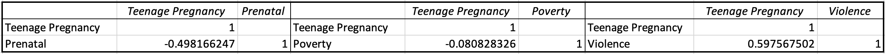

# Evaluating Teen Pregnancy Risk Factors and Prevention Policy in Baltimore, MD.
## Executive Summary
A wealth of scientific literature demonstrates how teenage pregnancy can [stifle a woman's educational attainment and professional opportunities](https://www.mcser.org/journal/index.php/jesr/article/viewFile/542/567). Teenage pregnancy is [especially prominent in Baltimore, MD](https://health.baltimorecity.gov/node/170), where a high teen birth rate disproportionately affects the city's black and low income residents. Our data analysis sought to determine the factors that influence teenage birth rates throughout the city and provide policy makers with strategies to decrease teen pregnancies and ultimately promote a more equitable environment. Our findings suggest that access to prenatal care and protection of minors against domestic violence are the greatest factors in reducing the teenage birth rate among black, low-income Baltimoreans. We therefore suggest that policy-makers increase funding for prenatal care facilities and domestic violence shelters in specific areas of the city, and reform police procedures for domestic violence in order to place minors in more frequent contact with social and healthcare workers. 

## The Challenge of Teenage Pregnancy 
### Business Question
What are the risk factors of teenage pregnancy in Baltimore, and how can the city's government mitigate these factors and lower its teenage birth rate?

### Why Teenage Pregnancy Policy is Important
[Only 67% of teenage mothers](https://sedl.org/txcc/resources/briefs/number5/bp_childcare.pdf) in the U.S. graduate high school. High school graduates [earn around 40% more than their peers who dropped out](https://sedl.org/txcc/resources/briefs/number5/bp_childcare.pdf). These two statistics illustrate how teenage pregnancy can reinforce gender inequality by depriving women of education and income. Furthermore, [CDC research](https://www.cdc.gov/teenpregnancy/about/social-determinants-disparities-teen-pregnancy.htm) has established that racial and socioeconomic disparities contribute to teen pregnancy rates. In effect, teenage pregnancy creates a self-perpetuating cycle of poverty for women, low-income individuals, and racial minorities in America. As Baltimore is one of America's [most socioeconomically unequal cities](https://www.brookings.edu/on-the-record/beyond-baltimore-thoughts-on-place-race-and-opportunity/), it is imperative that its government addresses the issue of teenage pregnancy. If the city continues its current trend of high teenage birth rates, it risks deepening its highly racialized poverty and, by consequence, inhibiting its citizens' economic opportunities and quality of life. 

## Our Solution
Using [Opportunity Atlas](https://www.opportunityatlas.org/) data on income and race ditribution in Baltimore, we found that the demographic with the highest teen pregnancy rate was low-income, Black populations in neighborhoods within the ["Black Butterfly,"](https://apps.urban.org/features/baltimore-investment-flows/), or the eastern and western regions of the city with high precentages of Black residents and low economic growth.

 

With existing data confirming drastically higher teen pregnancy rates in low-income, Black neighborhoods of the city, which sociocutural factors further influence teen pregnancy in these areas? 

### Data Questions and Sources
Is there a relationship observed between teen pregnancy and access to prenatal care, middle school attendance (where sexual education programs are integrated into school curriculum), children living in poverty, high school dropout rate, prevalence of juvenile arrests, and domestic violence? If so, in what neighborhoods are such risk factors most prominent? Ultimately, how can we translate our data results into policy that is effective at mitigating teen pregnancy in Baltimore? 

### Data Sources: 
1. Opportunity Insights' [Opportunity Atlas](https://www.opportunityatlas.org/): Online database of anonymous data following 20 million Americans from childhood to mid-30s with the goal of identifying areas of the United States with best and worst social mobility.
2. Baltimore Neighborhood Indicators Alliance [Vital Signs Open Data Portal](https://vital-signs-bniajfi.hub.arcgis.com): Community-based data points that give a snapshot of overall health and economic growth of a neighborhood.

__Defining Data Parameters:__ Each variable was categorized by census tract and neighborhood name.

1. __Teen Birth Rate:__ fraction of women who gave birth while between the ages of 13-19.
2. __Access to Prenatal Care:__ percentage of women who had access to prenatal care in the first trimester of pregnancy.
3. __Middle School Attendance:__ percentage of middle school aged students who actively attend middle school.
4. __Children Living in Poverty:__ percentage of persons under age of 18 living in households where total income fell below the poverty threshold out of all children in households in the specific neighborhood.
5. __Juvenile Arrest Rate:__ number of persons aged 10 to 17 arrested per 1,000 juveniles.
6. __Domestic Violence Rate:__ rate of calls to emergency 911 for domestic violence per 1,000 residents.

### Data Analysis
#### Relationship Between Teenage Pregnancy and Sociocultural Risk Factors
To determine the prevalent risk factors of teenage pregnancy in Baltimore, we performed a multiple linear regression model on the aforementioned variables. 

 

P-values below the benchmark of 0.05 are considered statistically significant. This indicates that out of all risk factors in question, access to prenatal care, children living in poverty, and prevalance of domestic violence are the three variables that are statistically significant enough to influence teen pregnancy rates in a specific neighborhood. An overall R-squared value of 0.52, though not close to 1.0, shows that approximately half of the variation in teen pregnancy rates can be attributed to the influence of the statistically significant risk factors. The standard error value of 0.105 confirms the validity of the modeled regression line; actual data points fall close to the predictive trendline, so it is an accurate model to use when predicting teen pregnancy rate.

Looking further into how the previously identified risk factors affect teen pregnancy, the following correlations between are observed: there is a relatively strong negative correlation between teen pregnancy and access to prenatal care. The higher the percentage of mothers who received prenatal care, the lower the teen pregnancy rate. This indicates that a lack of access to reproductive healthcare is a risk factor for teen pregnancy. There is a weak negative correlation between teen pregnancy and the percentage of children living in poverty. Although this negative correlation is negligible, it suggests the neighborhoods with higher percentages of children living in poverty may actually have lower teen pregnancy rates. This contradicts [previous research](https://github.com/John-Frye/baltimore-charleston-regression-on-race-income-teen-pregnancy/blob/master/Baltimore_Charleston_Teenage_Pregnancy_Regression.xlsx) showing a correlation between higher teen pregnancy rates and low household incomes. The explanation for this discrepancy can be found within the dataset parameters specified above: the percentage of children below poverty was computed using the poverty threshold value of all households in each neighborhood. In neighborhoods where the poverty threshold value was low, a smaller percentage of children were considered to be living below the poverty line, even though the neighborhood was low-income compared to the rest of the city. Thus, children in low-income households that would be considered impoverished when compared to all of Baltimore may not be counted as "in poverty" because the metric only measures poverty in relation to one's neighborhood. Children from such a background might exhibit a high teenage birth rate, but be classified as not in poverty despite their low household income. Lastly, there is a strong positive correlation between the teenage birthrate and domestic violence. The higher the prevalence of domestic vioelnce reports, the higher the teen birth rate. This correlation indicates that family instability and a lack of social support (as expressed by domestic violence) is a risk factor of teen pregnancy. 

#### Identifying High-Risk Neighborhoods with Cluster Analysis

Baltimorean neighborhoods with available data can be classified by four clusters:

__Cluster 1:__ Low teen birth rates, low access to prenatal care, high childhood poverty rates, low domestic violence rates. Accounts for 15% of Baltimore neighborhoods with available data.
__Cluster 2:__ High teen birth rates, low access to prenatal care, high childhood poverty rates, high domestic violence rates. Accounts for 39% of Baltimore neighborhoods with available data.
__Cluster 3:__ High teen birth rates, low access to prenatal care, low childhood poverty rates, high domestic violence rates. Accounts for 27% of Baltimore neighborhoods with available data.
__Cluster 4:__ Low teen birth rates, high access to prenatal care, low childhood poverty rates, low domestic violence rates. Accounts for 18% of Baltimore neighborhoods with available data.

High-risk neighborhoods in Cluster 2, including Harlem Park, Allendale, and Frankford, have higher than average teen pregnancy rates, lower access to prenatal care, higher child poverty rates, and higher domestic violence rates. Low-risk neighborhoods in Cluster 4, including Fells Point, Homeland, and South Baltimore, have lower than average teen pregnancy rates, higher access to prenatal care, lower child poverty rates, and lower domestic violence rates. 

 

High-risk neighborhoods, as shown in this map, are almost exclusively within the boundaries of the "Black Butterfly." This confirms that the demographic experiencing disparities and at the highest risk for the rise in teen pregnancy are, indeed, low-income, Black populations. These populations reside within the communities that lack prenatal healthcare services, struggle with higher than average household poverty, and report higher than average domestic violence rates. Thus, in order to design policies to reduce teenage pregnancy rates in the city, policy makers need to target social programs at these high-risk neighborhoods.

# Policy Recommendations and Next Steps
Baltimore's current implementation of the [Teen Pregnancy Prevention Initiative](https://health.baltimorecity.gov/node/170) is primarily focused on partnerships with community agencies to engage with the youth, increased access to sexual health and family planning services, and use a social media presence to encourage conversations about reproductive and sexual health. The policy does mention outreach efforts in specific populations (e.g. youths in the foster care system or teen parents) but does not directly target its programs to high-risk neighborhoods. 

Data results from this project prove how crucial it is for teen pregancy prevention policy to address the influence of sociocultural and environmental factors, including access to prenatal care, child poverty, and domestic violence, on teen pregnancy rates. Baltimore city should increase funding to family planning and prenatal care facilities, with the goal of constructing more facilities in high-risk neighborhoods with little to no access to sexual health resources. The Baltimore City Health Department lists only [2 family planning facilities](https://health.baltimorecity.gov/family-planning-reproductive-health) in underserved neighborhoods, which is certainly not adequate to deliver services and resources to all neighborhoods within the "Black Butterfly." Furthermore, the city government should add information about where and how to access prenatal care in its current social media campaign and in its public schools' sexual health curriculum. 

In areas of high child poverty and high domestic violence rates, residents need access to family supportive housing and domestic violence shelters. Baltimore city should therefore increase funding for domestic violence shelters and open facilities in high-risk neighborhoods, as there is currently [only one facility](https://www.baltimorecountymd.gov/departments/planning/preventingeandendinghomelessness/shelterandhousingfacilities.html) within the city proper. All domestic violence shelters should offer access to contraceptives, as well as information about family planning services, to minors within these facilities. 

To ensure that minors experiencing domestic violence are more likely to use these shelters, Baltimore should model its domestic violence policing procedures off of those in states like Delaware and Massachusetts. [Delaware uses a Domestic Violence Response Team (DVRT)](https://www.muckrock.com/news/archives/2017/oct/18/dv-policies/) comprised of advocates within a particular community that accompany police on all domestic violence calls. DVRT respondents should provide victims with information about and, if possible, transportation to domestic violence shelters. In line with Massachusetts procedures, police should [implement a policy of mandatory, temporary separation](https://www.bradbaileylaw.com/legal-blog/2020/august/domestic-violence-mandatory-arrest-policies/) between victims and potential abusers in order to provide victims with a greater flexibility to interact with the DVRT and access domestic violence resources.   

Ultimately, policies specifically catered to the needs of each disadvantaged neighborhood in Baltimore would be the most effective approach to further curbing the rise in teen pregnancy rates in communities. Future data analysis into the efficacy of reproductive and sexual health education within the city's school system, use of contraceptives in youth populations, and percentage of sexually active youths by neighborhood would further identify the communities that lack healthcare infrastructure.

## Error Analysis
As described in the project, the metric for childhood poverty was relative to specific communities as opposed to the city as a whole. Furthermore, many of the census tracts in Baltimore lacked data for all of the variables in our analysis, which meant that they could not be included in either our linear regression or cluster analysis.

## Step-by-Step Instructions
Step-by-step instructions for how we performed our data analysis [can be found here.](https://github.com/John-Frye/evaluating_teen_pregnancy_policy_in_baltimore/blob/main/Step_by_Step_Instructions_MidTerm.xlsx)

