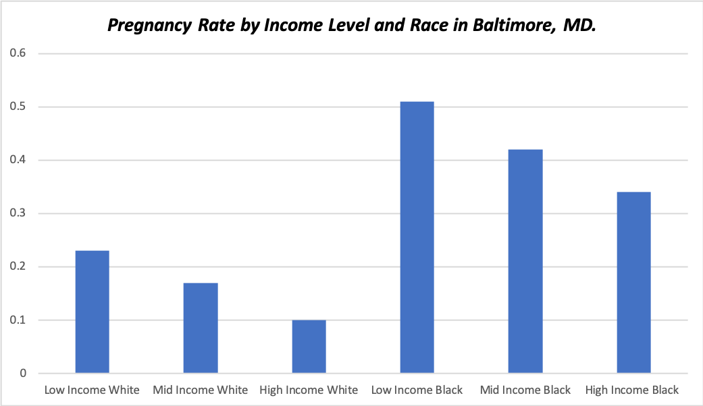

## Evaluating Teen Pregnancy Risk Factors and Prevention Policy in Baltimore, MD.
Previous [CDC](https://www.cdc.gov/teenpregnancy/about/social-determinants-disparities-teen-pregnancy.htm) research has established that racial and socioeconomic disparities contribute to teen pregnancy rates, and this holds true in Baltimore: 
 

