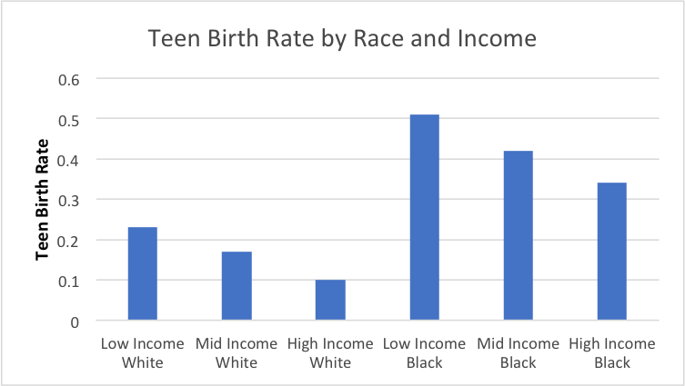
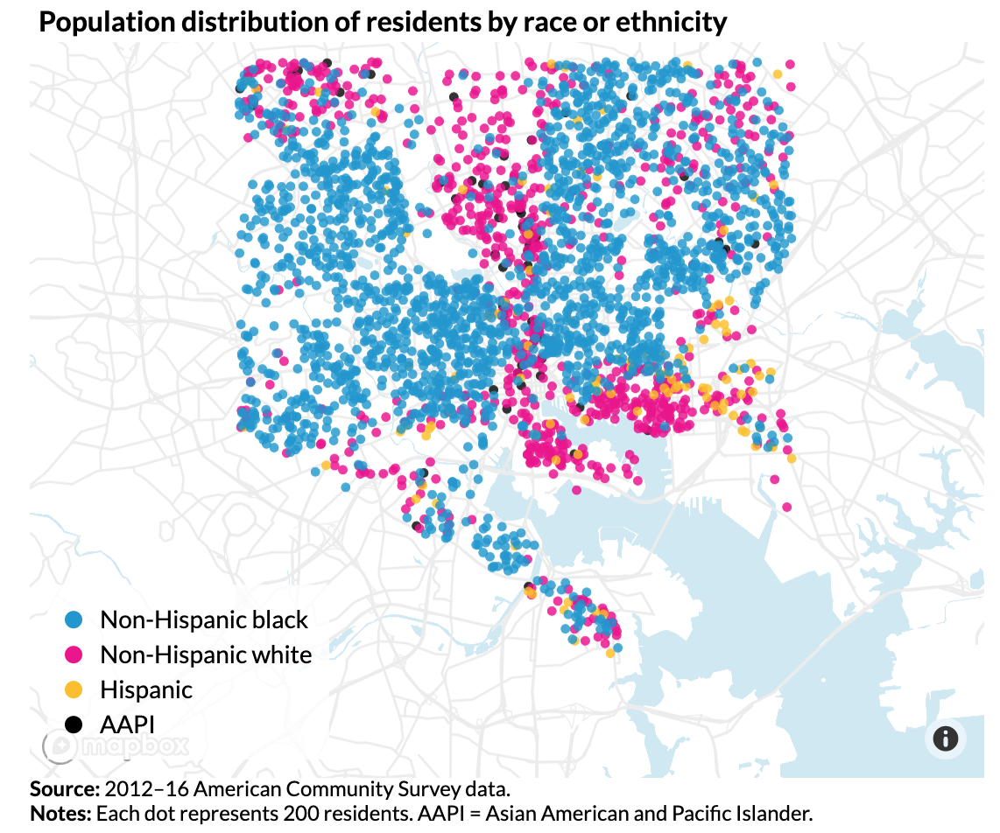
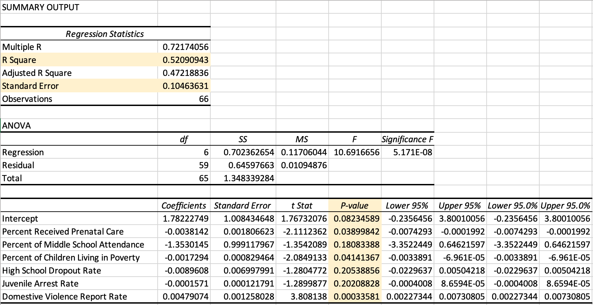
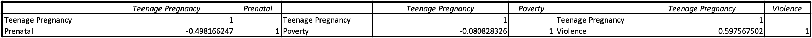
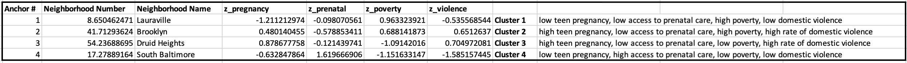

# Evaluating Teen Pregnancy Risk Factors and Prevention Policy in Baltimore, MD.
## Executive Summary
A wealth of scientific literature demonstrates how teenage pregnancy can [stifle a woman's educational attainment and professional opportunities](https://www.mcser.org/journal/index.php/jesr/article/viewFile/542/567). Teenage pregnancy is [especially prominent in Baltimore, MD](https://health.baltimorecity.gov/node/170), where a high teen birth rate disproportionately affects the city's black and low income residents. Our data analysis sought to determine the factors that influence teenage birth rates throughout the city and provide policy makers with strategies to decrease teen pregnancies and ultimately promote a more equitable environment. Our findings suggest that access to prenatal care and protection of minors against domestic violence are the greatest factors in reducing the teenage birth rate among black, low-income Baltimoreans. We therefore suggest that policy-makers increase funding for prenatal care facilities and domestic violence shelters in specific areas of the city, and reform police procedures for domestic violence in order to place minors in more frequent contact with social and healthcare workers. 

## The Challenge of Teenage Pregnancy 
### Business Question
What are the risk factors of teenage pregnancy in Baltimore, and how can the city's government mitigate these factors and lower its teenage birth rate?

### Why Teenage Pregnancy Policy is Important
[Over 67% of teenage mothers](https://sedl.org/txcc/resources/briefs/number5/bp_childcare.pdf) in the U.S. graduate high school. High school graduates [earn around 40% more than their peers who dropped out](https://sedl.org/txcc/resources/briefs/number5/bp_childcare.pdf). These two statistics illustrate how teenage pregnancy can reinforce gender inequality by depriving women of education and income. Furthermore, [CDC research](https://www.cdc.gov/teenpregnancy/about/social-determinants-disparities-teen-pregnancy.htm) has established that racial and socioeconomic disparities contribute to teen pregnancy rates. In effect, teenage pregnancy creates a self-perpetuating cycle of poverty for women, low-income individuals, and racial minorities in America. As Baltimore is one of America's [most socioeconomically unequal cities](https://www.brookings.edu/on-the-record/beyond-baltimore-thoughts-on-place-race-and-opportunity/), it is imperative that its government addresses the issue of teenage pregnancy. If the city continues its current trend of high teenage birth rates, it risks deepening its highly racialized poverty and, by consequence, inhibiting its citizens' economic opportunities and quality of life. 

## Our Solution
Using [Opportunity Atlas](https://www.opportunityatlas.org/) data on the relationship between income and race ditribution in Baltimore, the demographic with the highest teen pregnancy rate was low-income, Black populations in neighborhoods within the "Black Butterfly," the eastern and western regions of the city with high precentages of Black residents and low economic growth.
 
With existing data confirming drastically higher teen pregnancy rates in low-income, Black neighborhoods of the city, which sociocutural factors further influence teen pregnancy in these areas? 
### Data Questions and Sources
Is there a relationship observed between teen pregnancy and access to prenatal care, middle school attendance (where sexual education programs are integrated into school curriculum), children living in poverty, high school dropout rate, prevalence of juvenile arrests, and domestic violence? If so, in what neighborhoods are such risk factors most prominent? Ultimately, how can we translate our data results to implementing policy effective at mitigating teen pregnancy in Baltimore? 

Data Sources: 
1. Opportunity Insights' [Opportunity Atlas](https://www.opportunityatlas.org/): Online database of anonymous data following 20 million Americans from childhood to mid-30s with the goal of identifying areas of the United States with best and worst social mobility.
2. Baltimore Neighborhood Indicators Alliance [Vital Signs Open Data Portal](https://vital-signs-bniajfi.hub.arcgis.com): Community-based data points that give a snapshot of overall health and economic growth of a neighborhood.

Defining Data Parameters: Each variable was categorized by census tract and neighborhood name.
1. Teen Pregnancy Rate: percentage of pregnant women ages 13-19 
2. Access to Prenatal Care: percentage of women who had access to prenatal care in the first trimester of pregnancy
3. Middle School Attendance: percentage of middle school students
4. Children Living in Poverty: percentage of persons under age of 18 living in households where total income fell below the poverty threshold out of all children in households in the specific neighborhood.
5. Juvenile Arrest Rate: number of persons aged 10 to 17 arrested per 1,000 juveniles
6. Domestic Violence Rate: rate of calls to emergency 911 for domestic violence per 1,000 residents

### Data Analysis
#### Relationship Between Teenage Pregnancy and Sociocultural Risk Factors
Before delving into the prevalence of risk factors in each neighborhood, a multiple linear regression model identified the risk factors that were correlated with teenage pregnancy. 
 
P-values below the stastical benchmark of 0.05 indicates that out of all risk factors in question, access to prenatal care, children living in poverty, and prevalance of domestic violence are the three variables that are statistically significant enough to influence teen pregnancy rates in a specific neighborhood. An overall R-squared value of 0.52, though not close to 1.0, proves that approximately half of the variation in teen pregnancy rates can be attributed to the influence of the statistically significant risk factors. The standard error value of 0.105 confirms the validity of the modeled regression line; actual data points fall close to the predictive trendline, so it is an accurate model to use when predicting teen pregnancy rate.

Looking further into how the previously identified risk factors affect teen pregnancy, the following correlations between are observed: there is a relatively strong negative correlation between teen pregnancy and access to prenatal care - the higher the percentage of mothers who received prenatal care, the lower the teen pregnancy rate. There is a weak negative correlation between teen pregnancy and children living in poverty. Although this negative correlation is negligible, it suggests the neighborhoods with higher percentages of children living in poverty may actually have lower teen pregnancy rates. This contradicts previous research showing higher teen pregnancy rates in low-income neighborhoods. The explanation for this discrepancy can be found within the dataset parameters specified above: the percentage of children below poverty was computed using the poverty threshold value of all households in each neighborhood. Thus, in neighborhoods where the poverty threshold value was low, a smaller percentage of children were considered to be living below the poverty line, even though the neighborhood was low-income compared to the rest of the city. Thus, the dataset shows a high percentage of children living below the poverty line in low-income neighborhoods with low teen pregnancy rates. This explanation may also apply to middle- or high-income neighborhoods with low percentage of children living below the poverty line with high teen birth rates. Lastly, there is a strong positive correlation between teen pregnancy and domestic violence - the higher the prevalence of domestic vioelnce reports, the higher the teen pregnancy rate. This correlation aligns with family instability and lack of social support as a risk factor of teen pregnancy. 

#### Identifying High-Risk Neighborhoods with Cluster Analysis

High-risk neighborhoods in Cluster 3, including Harlem Park, Allendale, and Frankford, have higher than average teen pregnancy rates, lower access to prenatal care, higher child poverty rates, and higher domestic violence rates. Low-risk neighborhoods in Cluster 4, including Fells Point, Homeland, and South Baltimore, have lower than average teen pregnancy rates, higher access to prenatal care, lower child poverty rates, and lower domestic violence rates. 
 
The distribution of high-risk neighborhoods on this map  

